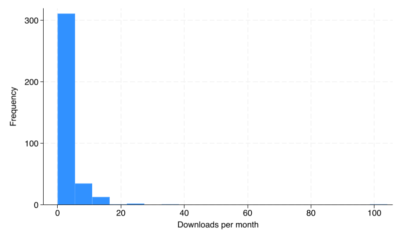

This report covers the period between September 1, 2023 and August 31, 2024. In this period, 79 replication packages have been submitted and 90 packages have been accepted. 

We now have four complete years of data under the new Data Availability Policy. This makes it possible to make comparisons and identify changes. 

## Turnaround times

A key performance indicator is the number of revisions a package goes through before acceptance. 

The majority of packages are accepted only after revisions, but the number and share of packages accepted without revisions have increased. This year, 13 packages were accepted without revisions. Most packages are accepted on first revision. The Figure plots the number of packages by revisions over time. Around 78 percent of packages are accepted after at most one revision (approximately same as last year).

{ width=70% }

The average package accepted this year received their first response from the Data Editor in 24 days (same as last year). This statistic excludes papers where the Data Availability Policy does not apply. For revisions, the mean response time is 8 days (same as last year), with the majority of packages decided in much shorter time (see Figures).

{ width=70% }

{ width=70% }

{ width=70% }

The operations have matured to a constant pace. The number and speed of processed packages are stable over time. We still struggle, however, with trivial mistakes in packages that slow down the process unnecessarily. This suggests gap in my communication with authors about what is expected in a replication package. We are working on improving this by author education (website, mini-courses) and automation (checklists, templates).

## Impact

The median replication package is downloaded from Zenodo 2 times a month. This includes views and downloads by author and editorial team. As the figure shows, there is substantial heterogeneity across packages in their download statistics, but all packages have some visibility.

{ width=60% }

Download statistics are highly correlated over time. Packages that were popular last year are often downloaded also this year (next Figure). This suggests that the download statistics capture genuine interest and not only driven by early downloads by authors and the editorial team.

{ width=60% }

