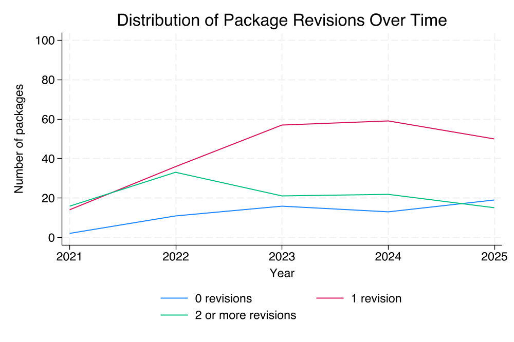
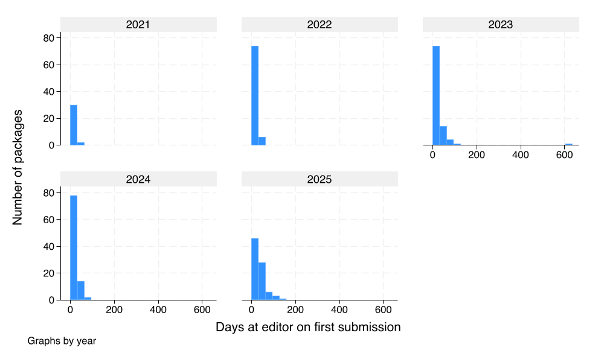
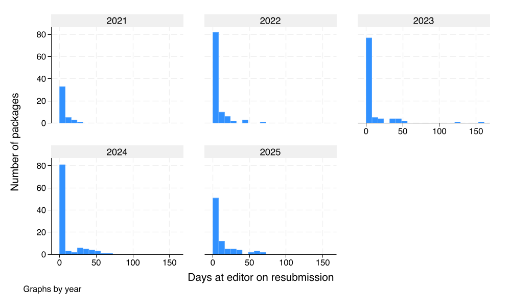

This report covers the period between September 1, 2024 and August 31, 2025. In this period, 72 replication packages have been submitted and 83 packages have been accepted.

We now have five complete years of data under the new Data Availability Policy. This makes it possible to make comparisons and identify changes. 

## Turnaround times

A key performance indicator is the number of revisions a package goes through before acceptance. 

The majority of packages are accepted only after revisions, but the number and share of packages accepted without revisions have increased. This year, 19 packages (23 percent) were accepted without revisions. Most packages are accepted on first revision. The Figure plots the number of packages by revisions over time. Around 82 percent of packages are accepted after at most one revision (a bit better than last year).

{ width=70% }

The average package accepted this year received their first response from the Data Editor in 33 days (up from 24 last year). This statistic excludes papers where the Data Availability Policy does not apply. For revisions, the mean response time is 12 days (up from 8 last year), with the majority of packages decided in much shorter time (see Figures).

{ width=70% }

{ width=70% }

{ width=70% }

The operations have matured to a constant pace. The number and speed of processed packages are stable over time. 

## Impact

The median replication package is downloaded from Zenodo 2.6 times a month (same as last year). We excluded the first six months of the package to control for views by the authors and the editorial team. As the figure shows, there is substantial heterogeneity across packages in their download statistics, with some being very successful. All packages have some visibility.

{ width=60% }
