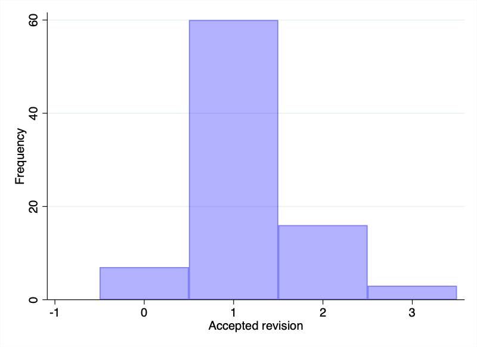
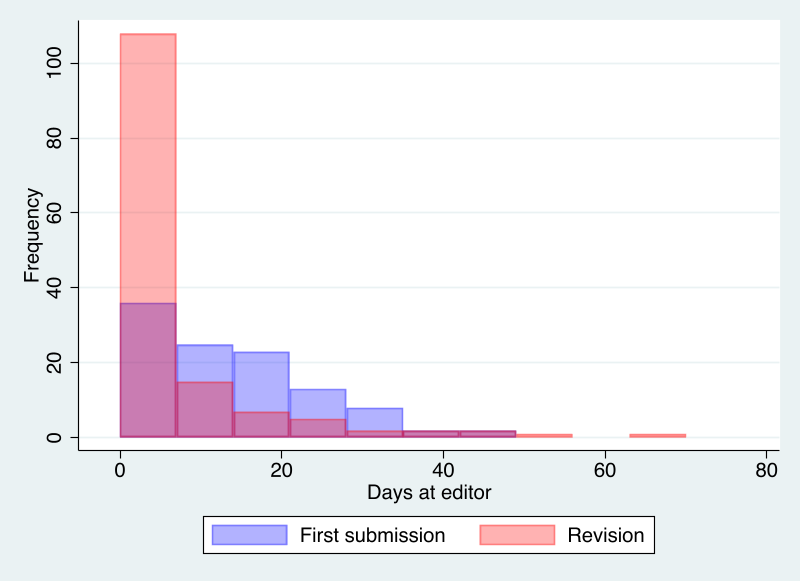
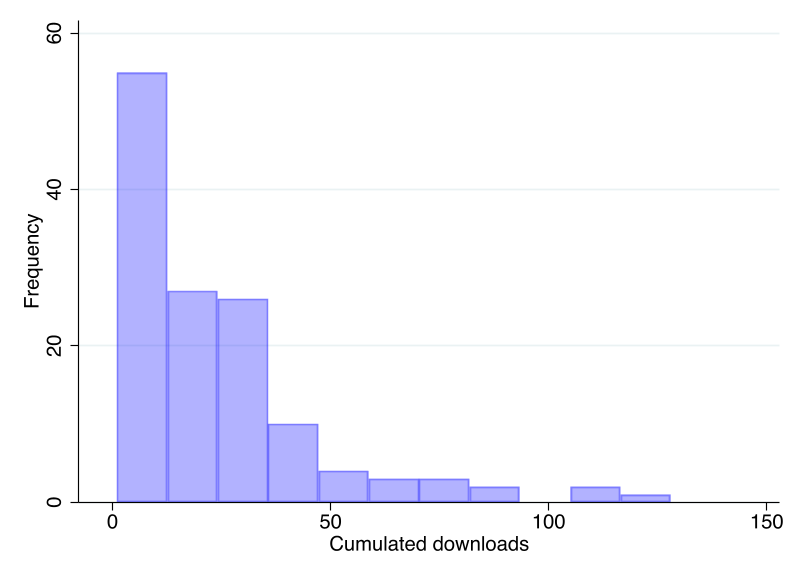
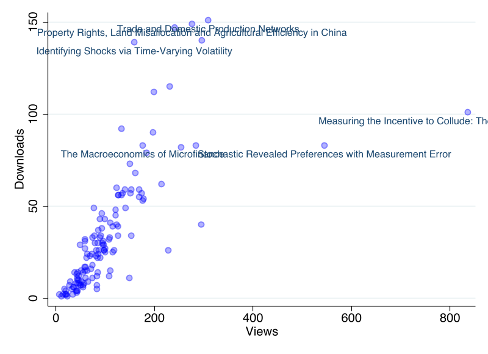

This report covers the period between September 1, 2021 and August 31, 2022. In this period, 87 replication packages have been submitted, and 78 packages have been accepted. There is no final decision yet on 36 packages, 8 are at the editorial team, 28 are with authors.

We now have two complete years of data under the new Data Availability Policy. This makes it possible to make comparisons and identify changes. 

## Turnaround times

The vast majority of packages are accepted only after revisions; only six packages were accepted as submitted. Most packages are accepted on first revision. The Figure plots the number of packages by revisions at the time acceptance. Around 58 percent of packages are accepted after at most one revision (up from 52 percent last year).

{ width=75% }

The average package accepted this year received their first response from the Data Editor in 15 days (up from 12 days last year). This statistic excludes papers where the Data Availability Policy does not apply. For revisions, the mean response time is 6 days, with the majority of packages decided in much shorter time (see Figure).

{ width=75% }

The average time authors spend with a revision is 25 days.

## Impact

OLD DATA

The median replication package is viewed on Zenodo 48 times and downloaded 12 times. This includes views and downloads by author and editorial team. As the figure shows, there is substantial heterogeneity across packages in their download statistics.

{ width=75% }

{ width=75% }

As we have no baseline measures about the use of replication packages, download statistics will be more useful after a period of observation. The 2022 report will include an analysis of trends and patterns.
